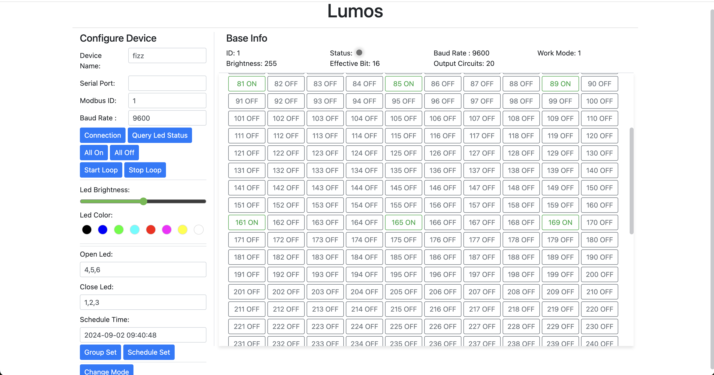

English | [中文](./README_ZH.md)

## Lumos

A large-scale lighting control program using the RS485 protocol.

Blog post introduction: [https://blog.csdn.net/github_35631540/article/details/138716728](https://blog.csdn.net/github_35631540/article/details/138716728)

Demo videos:

- [https://www.bilibili.com/video/BV1rt421c7Dr/](https://www.bilibili.com/video/BV1rt421c7Dr/)
- [https://www.bilibili.com/video/BV1ub421a7wc/](https://www.bilibili.com/video/BV1ub421a7wc/)

### Features

- Supports serial communication
- Supports modification of different communication parameters
- Real-time status querying of lights
- Turn all lights on or off
- Loop mode
- Brightness adjustment
- Set overall color
- Mode change
- Supports single LED mode and RGB mode
- Supports changing the color of individual LEDs
- Web access supported
- Buildable for Windows, Mac, and Linux clients
- English and Chinese language switching
- Timer mode
- Group control

### TODO

- Support Modbus TCP communication
- Support color display for LEDs (3 modes)
- Server mode

### Collaboration

If you need to use this software, please contact me via email at pangmengchen@gmail.com to obtain authorization.
This software requires specific lighting control boards and driver boards. The full equipment verification costs around 100 CNY.
